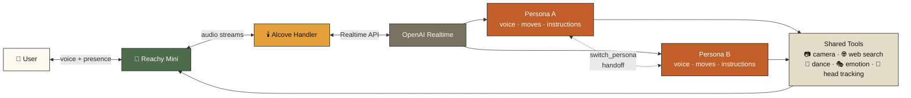

# 🕯️ Alcove

**The room inside the Haven.**

An open-source dual-persona voice framework for [Reachy Mini](https://github.com/pollen-robotics/reachy-mini). Two voices, one robot, one continuous conversation. Yours to personalize.

> Alcove was extracted from *Haven Kitchen* — my private, personal dual-persona kitchen companion. Haven stays closed; Alcove is the framework underneath, given away.

[](https://opensource.org/licenses/Apache-2.0)
[](https://www.python.org/downloads/)
[](https://github.com/pollen-robotics/reachy-mini)
[](https://huggingface.co/spaces/AccidentalCoder80/alcove)

---

## How it works

Two AI personas share one Reachy Mini. When a persona decides to hand off (based on what the user is asking), it calls the `switch_persona` tool — the current OpenAI Realtime session closes, the new persona opens their session with a different voice and a signature dance move, and the conversation continues seamlessly.



## What's in the box

- **Dual-persona architecture** — two personas share a single OpenAI Realtime session, with the conversation handed off between them at natural break points.
- **Handoff engine** — the *response-cancel-before-create* pattern that makes the incoming persona actually get to speak (this was the trickiest bit to get right).
- **Signature moves** — each persona configures a signature dance from the Reachy Mini library as their handoff cue, so users can *hear* AND *see* who's talking.
- **Vision** — a camera tool wired into the OpenAI Realtime image input, so personas can answer "what am I looking at?" questions.
- **Live web** — a Tavily-powered search tool for information beyond the model's training cutoff.
- **Motion & emotion** — dance, head movement, head tracking, and the full Reachy expressive kit.
- **Deploy patterns** — `runtime.env` for secrets, headless-mode fixes, fast-shutdown, package-data hygiene — all the pieces you need to actually ship on-robot.

## What's NOT in Alcove

Alcove is the *framework*, not a product. It ships with two blank personas (`persona_a`, `persona_b`) and no domain-specific tools. Bring your own personalities, prompts, and integrations.

## Quickstart

### Option 1 — Fork from Hugging Face *(easiest, no local setup)*

1. Visit the [Alcove Space](https://huggingface.co/spaces/AccidentalCoder80/alcove) → three-dot menu → **Duplicate this Space**
2. Rename `alcove/profiles/persona_a` and `alcove/profiles/persona_b` to your two characters
3. Write each persona's `instructions.txt` — who they are, how they speak, when to hand off
4. Pick each persona's voice in `voice.txt` (choose from OpenAI Realtime's voice list)
5. Install on your Reachy Mini via the **Discover Apps** panel in Reachy Mini Control

### Option 2 — Clone from GitHub

```bash
git clone https://github.com/Dev-Vibes-Daily/Alcove_HavenLiteVersion.git
cd Alcove_HavenLiteVersion
cp alcove/runtime.env.example alcove/runtime.env
# edit runtime.env with your OpenAI API key (and optional Tavily key)
pip install -e .
```

Then customize personas as in Option 1.

## Requirements

- A [Reachy Mini](https://github.com/pollen-robotics/reachy-mini) robot (SDK 1.9.0+)
- Python 3.10+
- An OpenAI API key with Realtime API access
- *Optional:* a [Tavily API key](https://tavily.com) for the web search tool

## Repository layout

```
alcove/
├── alcove/                     # Python package
│   ├── personas/               # Session handler + persona manager
│   ├── profiles/               # persona_a, persona_b, and example personas
│   ├── tools/                  # camera, web_search, dance, motion, emotion, switch_persona
│   ├── audio/                  # head wobbler, speech tapper
│   ├── vision/                 # optional local vision processors
│   ├── main.py                 # entry point
│   └── openai_realtime.py      # Realtime session wrapper
├── static/                     # optional dashboard UI
├── docs/                       # architecture notes + assets
├── tests/                      # pytest suite
├── external_content/           # starter templates for external customization
├── pyproject.toml
└── README.md
```

## Credits

Built by [@AccidentalCoder80](https://huggingface.co/AccidentalCoder80).

Standing on the shoulders of [Pollen Robotics](https://github.com/pollen-robotics)' beautiful [Reachy Mini](https://github.com/pollen-robotics/reachy-mini) platform and their [`reachy_mini_conversation_app`](https://huggingface.co/spaces/pollen-robotics/reachy_mini_conversation_app) starter.

## License

Apache 2.0. Take it, fork it, make it yours.
